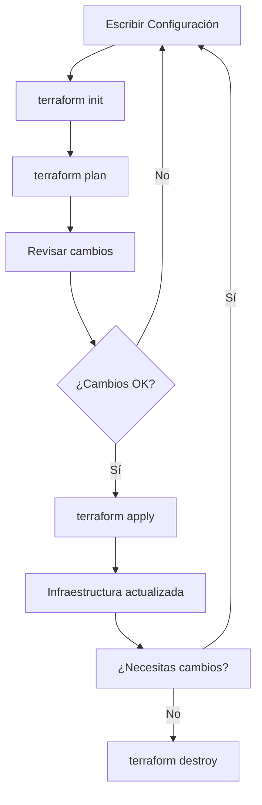

# Conceptos Fundamentales de Infrastructure as Code y Terraform

## 1. ¿Qué es Infrastructure as Code (IaC)?

### **Definición Simple**

Infrastructure as Code es la práctica de **describir y gestionar tu infraestructura tecnológica usando código** en lugar de configuraciones manuales.

### **Analogía del Mundo Real**

Imagina que quieres construir una casa:

**🏠 Método Tradicional (Manual):**

-   Vas al terreno y dices al constructor: "Pon una ventana aquí, una puerta allá"
-   Si necesitas otra casa igual, tienes que repetir todo el proceso
-   Es fácil cometer errores o inconsistencias

**📋 Método IaC (Con Planos):**

-   Creas un plano detallado de la casa
-   Le das el plano al constructor y él la construye exactamente igual
-   Puedes usar el mismo plano para construir 100 casas idénticas
-   Todo está documentado y es reproducible

### **Beneficios de IaC**

**1. Consistencia**

```bash
# Sin IaC: "Creo que el servidor tenía 4GB de RAM... o eran 8GB?"
# Con IaC: 
instance_type = "t3.medium"  # Siempre 4GB RAM, documentado

```

**2. Reproducibilidad**

```bash
# Sin IaC: Crear 10 servidores = 10 configuraciones manuales diferentes
# Con IaC: 
count = 10  # Crea 10 servidores idénticos automáticamente

```

**3. Versionado**

```bash
# Como código, puedes ver cambios en el tiempo
git log infrastructure/
# "Juan añadió balanceador de carga el 15/03"
# "María incrementó capacidad el 20/03"

```

**4. Automatización**

```bash
# Sin IaC: Configurar manualmente cada servidor (2 horas por servidor)
# Con IaC: terraform apply (5 minutos para 50 servidores)

```

----------

## 2. ¿Qué es Terraform?

### **Definición**

Terraform es una **herramienta de código abierto** que te permite **definir, planificar y crear** infraestructura usando un lenguaje declarativo llamado HCL (HashiCorp Configuration Language).

### **¿Qué Significa "Declarativo"?**

**Imperativo (cómo hacerlo):**

```bash
# Le dices PASO A PASO qué hacer
1. ssh servidor1
2. sudo apt update
3. sudo apt install nginx
4. sudo systemctl start nginx
5. sudo systemctl enable nginx

```

**Declarativo (qué quieres):**

```hcl
# Le dices QUÉ quieres, Terraform decide CÓMO hacerlo
resource "aws_instance" "web_server" {
  ami           = "ami-12345"
  instance_type = "t3.micro"
  
  user_data = <<-EOF
    #!/bin/bash
    apt update
    apt install -y nginx
    systemctl start nginx
  EOF
}

```

----------

## 3. Conceptos Core de Terraform

### **3.1 Providers (Proveedores)**

**¿Qué son?** Los providers son **plugins que permiten a Terraform comunicarse** con diferentes servicios y APIs.

**Analogía:** Son como "traductores" que hablan el idioma de cada servicio.

```hcl
# Provider para AWS
terraform {
  required_providers {
    aws = {
      source  = "hashicorp/aws"
      version = "~> 5.0"
    }
  }
}

# Provider para Azure
terraform {
  required_providers {
    azurerm = {
      source  = "hashicorp/azurerm"
      version = "~> 3.0"
    }
  }
}

# Provider para archivos locales (para aprender)
terraform {
  required_providers {
    local = {
      source  = "hashicorp/local"
      version = "~> 2.1"
    }
  }
}

```

**Providers Populares:**

-   **aws**: Amazon Web Services
-   **azurerm**: Microsoft Azure
-   **google**: Google Cloud Platform
-   **kubernetes**: Kubernetes clusters
-   **docker**: Docker containers
-   **local**: Archivos y directorios locales
-   **random**: Valores aleatorios
-   **time**: Operaciones de tiempo

### **3.2 Resources (Recursos)**

**¿Qué son?** Los resources son los **componentes de infraestructura** que quieres crear y gestionar.

**Sintaxis Básica:**

```hcl
resource "TIPO_DE_RECURSO" "NOMBRE_LOCAL" {
  # Configuración del recurso
  atributo1 = "valor1"
  atributo2 = "valor2"
}

```

**Ejemplos Prácticos:**

```hcl
# Crear un archivo local
resource "local_file" "mi_config" {
  content  = "Configuración de mi aplicación"
  filename = "/tmp/app.conf"
}

# Crear una instancia EC2 en AWS
resource "aws_instance" "mi_servidor" {
  ami           = "ami-12345678"
  instance_type = "t3.micro"
  
  tags = {
    Name = "Mi Servidor Web"
  }
}

# Crear una base de datos RDS
resource "aws_db_instance" "mi_base_datos" {
  engine         = "mysql"
  engine_version = "8.0"
  instance_class = "db.t3.micro"
  username       = "admin"
  password       = var.db_password
}

```

### **3.3 State (Estado)**

**¿Qué es?** El state es un **archivo JSON que mantiene Terraform** para rastrear qué recursos ha creado y cuál es su estado actual.

**¿Por Qué es Importante?**

-   **Mapeo**: Conecta tu configuración con los recursos reales
-   **Performance**: Evita consultar constantemente los proveedores
-   **Colaboración**: Permite que un equipo trabaje sobre la misma infraestructura

**Ejemplo Visual:**

```
Tu Configuración (main.tf)     State File              Infraestructura Real
┌─────────────────────┐       ┌──────────────┐        ┌─────────────────┐
│ resource "aws_      │  <──> │ "aws_instance│   <──> │ Instancia EC2   │
│ instance" "web" {   │       │ .web": {     │        │ i-1234567890    │
│   ami = "ami-123"   │       │   "id": "i-  │        │ Estado: running │
│   type = "t3.micro" │       │   1234567890"│        │ IP: 10.0.1.5    │
│ }                   │       │ }            │        │                 │
└─────────────────────┘       └──────────────┘        └─────────────────┘

```

**Comandos de State:**

```bash
# Ver recursos en el state
terraform state list

# Ver detalles de un recurso específico
terraform state show aws_instance.web

# Mostrar todo el state de forma legible
terraform show

```

### **3.4 Configuration (Configuración)**

**¿Qué es?** Son los **archivos .tf** donde describes qué infraestructura quieres.

**Estructura Típica:**

```
mi-proyecto/
├── main.tf          # Recursos principales
├── variables.tf     # Variables de entrada
├── outputs.tf       # Valores de salida
├── versions.tf      # Versiones de providers
└── terraform.tfvars # Valores de las variables

```

**Ejemplo de Configuración Completa:**

```hcl
# variables.tf
variable "app_name" {
  description = "Nombre de la aplicación"
  type        = string
  default     = "mi-app"
}

variable "environment" {
  description = "Entorno (dev, staging, prod)"
  type        = string
}

# main.tf
resource "aws_instance" "app_server" {
  ami           = "ami-12345678"
  instance_type = "t3.micro"
  
  tags = {
    Name        = "${var.app_name}-${var.environment}"
    Environment = var.environment
  }
}

# outputs.tf
output "server_ip" {
  description = "IP pública del servidor"
  value       = aws_instance.app_server.public_ip
}

# terraform.tfvars
app_name    = "blog"
environment = "production"

```

### **3.5 Plan**

**¿Qué es?** El plan es una **vista previa** de los cambios que Terraform va a realizar antes de aplicarlos.

**Analogía:** Es como el "preview" antes de enviar un email importante.

```bash
terraform plan

```

**Ejemplo de Output:**

```
Terraform will perform the following actions:

  # aws_instance.web_server will be created
  + resource "aws_instance" "web_server" {
      + ami           = "ami-12345678"
      + instance_type = "t3.micro"
      + public_ip     = (known after apply)
      + tags          = {
          + "Name" = "mi-servidor-web"
        }
    }

Plan: 1 to add, 0 to change, 0 to destroy.

```

**Tipos de Cambios:**

-   **`+`** = Crear recurso nuevo
-   **`-`** = Eliminar recurso
-   **`~`** = Modificar recurso existente
-   **`-/+`** = Recrear recurso (eliminar y crear)

### **3.6 Apply**

**¿Qué es?** Apply **ejecuta** los cambios planificados, creando, modificando o eliminando recursos.

```bash
terraform apply

```

**Proceso de Apply:**

1.  **Genera el plan** automáticamente
2.  **Te muestra** qué va a cambiar
3.  **Te pide confirmación** (escribe "yes")
4.  **Ejecuta** los cambios
5.  **Actualiza** el state file

----------

## 4. Workflow de Terraform

### **Ciclo de Vida Básico**



### **Comandos Esenciales**

**1. Inicialización**

```bash
terraform init
# ¿Qué hace? Descarga providers, configura backend
# ¿Cuándo? Primera vez y cuando cambias providers

```

**2. Validación**

```bash
terraform validate
# ¿Qué hace? Verifica sintaxis de configuración
# ¿Cuándo? Después de escribir/modificar código

```

**3. Formateo**

```bash
terraform fmt
# ¿Qué hace? Formatea el código consistentemente
# ¿Cuándo? Antes de hacer commit a git

```

**4. Planificación**

```bash
terraform plan
# ¿Qué hace? Muestra qué cambios se van a realizar
# ¿Cuándo? Antes de apply, para revisar cambios

```

**5. Aplicación**

```bash
terraform apply
# ¿Qué hace? Ejecuta los cambios
# ¿Cuándo? Cuando estés seguro de los cambios

```

**6. Destrucción**

```bash
terraform destroy
# ¿Qué hace? Elimina toda la infraestructura
# ¿Cuándo? Para limpiar recursos de prueba

```

----------

## 5. HCL (HashiCorp Configuration Language)

### **Sintaxis Básica**

**Bloques:**

```hcl
# Sintaxis: tipo "etiqueta" "nombre" { contenido }
resource "aws_instance" "ejemplo" {
  ami = "ami-12345"
}

variable "nombre" {
  description = "Mi variable"
  type        = string
}

```

**Tipos de Datos:**

```hcl
# String (texto)
variable "nombre" {
  type    = string
  default = "mi-app"
}

# Number (número)
variable "puerto" {
  type    = number
  default = 80
}

# Bool (verdadero/falso)
variable "activar_ssl" {
  type    = bool
  default = true
}

# List (lista)
variable "subnets" {
  type    = list(string)
  default = ["subnet-1", "subnet-2"]
}

# Map (mapa/diccionario)
variable "tags" {
  type = map(string)
  default = {
    Environment = "dev"
    Project     = "mi-proyecto"
  }
}

# Object (objeto complejo)
variable "servidor" {
  type = object({
    nombre = string
    cpu    = number
    ram    = number
  })
  default = {
    nombre = "web-server"
    cpu    = 2
    ram    = 4
  }
}

```

**Interpolaciones y Expresiones:**

```hcl
# Referencias a variables
resource "aws_instance" "web" {
  ami           = var.ami_id
  instance_type = var.instance_type
}

# Referencias a otros recursos
resource "aws_security_group" "web_sg" {
  name = "web-security-group"
}

resource "aws_instance" "web" {
  security_groups = [aws_security_group.web_sg.name]
}

# Funciones
resource "local_file" "config" {
  filename = "${path.module}/config-${timestamp()}.json"
  content  = jsonencode({
    app_name = upper(var.app_name)
    servers  = length(var.server_list)
  })
}

# Condicionales
resource "aws_instance" "web" {
  ami           = var.environment == "prod" ? var.prod_ami : var.dev_ami
  instance_type = var.environment == "prod" ? "t3.large" : "t3.micro"
}

```

----------

## 6. Casos de Uso Prácticos

### **Desarrollo Local**

```hcl
# Crear entorno de desarrollo consistent
resource "docker_container" "app" {
  image = "nginx:latest"
  name  = "dev-app"
  
  ports {
    internal = 80
    external = 8080
  }
}

```

### **Infraestructura en la Nube**

```hcl
# Crear aplicación web completa
resource "aws_vpc" "main" {
  cidr_block = "10.0.0.0/16"
}

resource "aws_subnet" "web" {
  vpc_id     = aws_vpc.main.id
  cidr_block = "10.0.1.0/24"
}

resource "aws_instance" "web_servers" {
  count         = 3
  ami           = "ami-12345678"
  instance_type = "t3.micro"
  subnet_id     = aws_subnet.web.id
}

```

### **Gestión de Configuraciones**

```hcl
# Generar archivos de configuración
resource "local_file" "nginx_config" {
  content = templatefile("nginx.conf.tpl", {
    server_name = var.domain_name
    backends    = aws_instance.web_servers[*].private_ip
  })
  filename = "/etc/nginx/sites-available/${var.domain_name}"
}

```

----------

## 7. Ventajas de Terraform vs Alternativas

### **Terraform vs Configuración Manual**

Aspecto

Manual

Terraform

**Tiempo**

Horas por servidor

Minutos para múltiples

**Errores**

Frecuentes

Reproducible

**Documentación**

Notas dispersas

Código autodocumentado

**Rollback**

Complejo

`terraform destroy`

**Escalamiento**

Linear

Automático

### **Terraform vs Otras Herramientas IaC**

**CloudFormation (AWS):**

```json
// CloudFormation (JSON) - Verboso
{
  "Resources": {
    "MyInstance": {
      "Type": "AWS::EC2::Instance",
      "Properties": {
        "ImageId": "ami-12345678",
        "InstanceType": "t3.micro"
      }
    }
  }
}

```

```hcl
# Terraform (HCL) - Más limpio
resource "aws_instance" "my_instance" {
  ami           = "ami-12345678"
  instance_type = "t3.micro"
}

```

**Ansible:**

-   **Ansible**: Excelente para configuración de software
-   **Terraform**: Excelente para infraestructura base

**Pulumi:**

-   **Pulumi**: Usa lenguajes de programación (Python, JS)
-   **Terraform**: Usa HCL declarativo (más simple para infraestructura)

----------

## 8. Conceptos Avanzados (Vista Previa)

### **Módulos**

```hcl
# Reutilizar configuraciones
module "web_app" {
  source = "./modules/web-app"
  
  app_name    = "blog"
  environment = "prod"
  instance_count = 3
}

```

### **Workspaces**

```bash
# Diferentes entornos con el mismo código
terraform workspace new dev
terraform workspace new staging
terraform workspace new prod

```

### **Remote State**

```hcl
# Compartir state entre equipos
terraform {
  backend "s3" {
    bucket = "mi-terraform-state"
    key    = "prod/terraform.tfstate"
    region = "us-east-1"
  }
}

```

----------

## 9. Mejores Prácticas Fundamentales

### **1. Organización de Código**

```
proyecto/
├── environments/
│   ├── dev/
│   ├── staging/
│   └── prod/
├── modules/
├── variables.tf
└── main.tf

```

### **2. Nomenclatura**

```hcl
# Usa nombres descriptivos
resource "aws_instance" "web_server" {  # ✅ Bueno
  # ...
}

resource "aws_instance" "server1" {     # ❌ Malo
  # ...
}

```

### **3. Variables**

```hcl
# Siempre documenta variables
variable "instance_type" {
  description = "Tipo de instancia EC2 (ej: t3.micro, t3.small)"
  type        = string
  default     = "t3.micro"
  
  validation {
    condition     = contains(["t3.micro", "t3.small", "t3.medium"], var.instance_type)
    error_message = "Tipo de instancia debe ser t3.micro, t3.small, o t3.medium."
  }
}

```

### **4. Outputs**

```hcl
# Expón información útil
output "web_server_ip" {
  description = "IP pública del servidor web"
  value       = aws_instance.web_server.public_ip
}

```

----------

## 10. ¿Por Dónde Empezar?

### **Ruta de Aprendizaje Recomendada:**

1.  **📚 Conceptos** ← _Estás aquí_
2.  **🖥️ Instalación** y configuración local
3.  **📄 Archivos locales** (sin cloud)
4.  **🔧 Variables** y outputs
5.  **📦 Módulos** simples
6.  **☁️ Provider cloud** (AWS/Azure/GCP)
7.  **🏗️ Proyecto real** multi-tier
8.  **👥 Colaboración** (remote state, CI/CD)

### **Recursos para Continuar:**

-   **Documentación oficial**: terraform.io
-   **Registry**: registry.terraform.io (módulos y providers)
-   **Tutoriales**: learn.hashicorp.com
-   **Comunidad**: r/Terraform, HashiCorp forums

¡Con estos conceptos fundamentales ya tienes la base sólida para comenzar tu viaje con Terraform! 🚀
